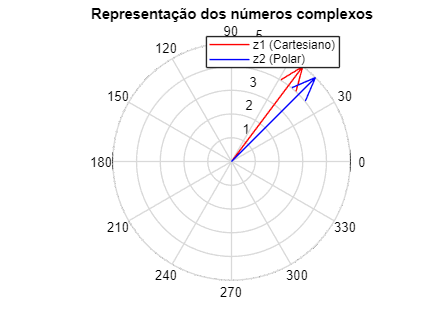
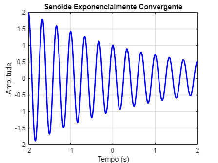
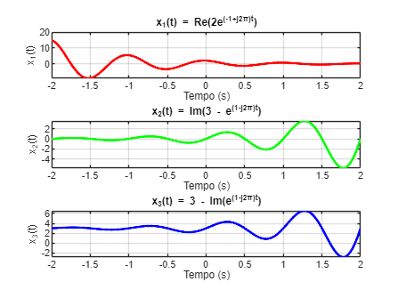
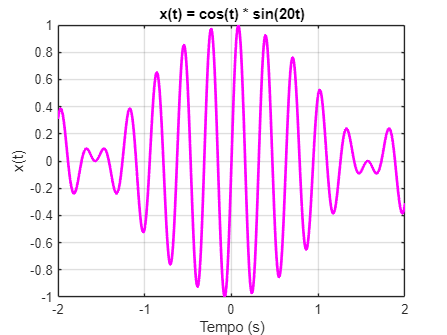
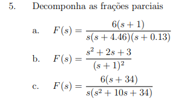
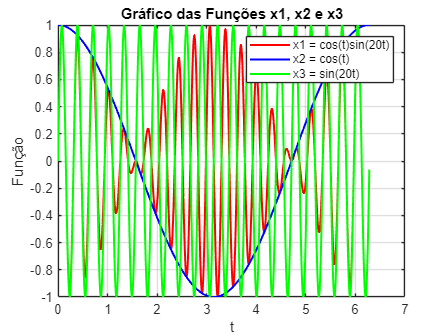
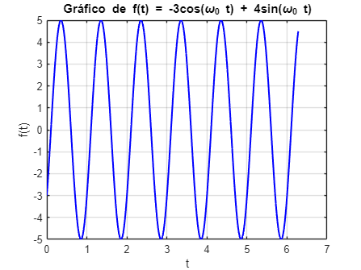
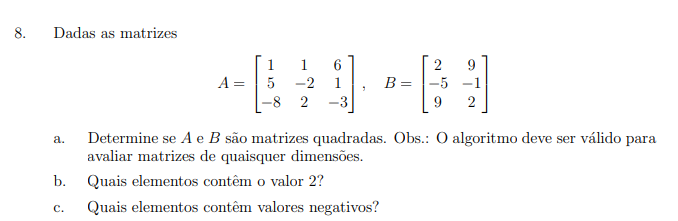
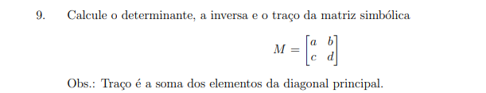
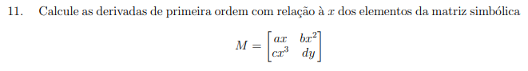

 **1. Explore os comandos cart2pol e pol2cart. Escolha dois números complexos: z1 (na forma Cartesiana) e z2 (na forma polar).** 


a. Converta\-os e trace os respectivos gráficos usando compass.

```matlab
z1 = 3 + 4i;
magnitude_z2 = 5;
angulo_z2 = pi/4; % Forma polar (5∠45°)
z2 = magnitude_z2 * exp(1i * angulo_z2);

[theta1, r1] = cart2pol(real(z1), imag(z1));

[x2, y2] = pol2cart(angulo_z2, magnitude_z2);
z2_cart = x2 + 1i*y2;

figure;
compass(z1, 'r'); hold on;
compass(z2, 'b');
legend('z1 (Cartesiano)', 'z2 (Polar)');
title('Representação dos números complexos');
```



b. Determine z1z2. 


c. Determine z1/z2. Mostre o resultado na janela de comando. 

```matlab
z_prod = z1 * z2;

z_div = z1 / z2;

fprintf('Produto z1 * z2 = %s\n', num2str(z_prod));
```

```matlabTextOutput
Produto z1 * z2 = -3.53553+24.7487i
```

```matlab
fprintf('Divisão z1 / z2 = %s\n', num2str(z_div));
```

```matlabTextOutput
Divisão z1 / z2 = 0.98995+0.14142i
```

**2. Determine a expressão para uma senóide exponencialmente convergente que oscila 3 vezes por segundo e cuja amplitude decresce 50% a cada 2 segundos. Trace o gr´afico do sinal entre −2 ≤ t ≤ 2.**

```matlab
A = 1;
freq = 3;
alpha = log(2)/2;

t = linspace(-2, 2, 1000);

x_t = A * exp(-alpha * t) .* cos(2 * pi * freq * t);

figure;
plot(t, x_t, 'b', 'LineWidth', 2);
grid on;
xlabel('Tempo (s)');
ylabel('Amplitude');
title('Senóide Exponencialmente Convergente');
```



 **3. Trace os gráficos de** 


 **a. x1(t) = Re(2e (−1+j2π)t )** 


 **b. x2(t) = Im(3 − e (1−j2π)t )** 


**c. x3(t) = 3 − Im(e (1−j2π)t )**

```matlab
x1_t = real(2 * exp((-1 + 1i * 2 * pi) * t));
x2_t = imag(3 - exp((1 - 1i * 2 * pi) * t));
x3_t = 3 - imag(exp((1 - 1i * 2 * pi) * t));

figure;
subplot(3,1,1);
plot(t, x1_t, 'r', 'LineWidth', 2);
grid on;
xlabel('Tempo (s)');
ylabel('x_1(t)');
title('x_1(t) = Re(2e^{(-1+j2π)t})');

subplot(3,1,2);
plot(t, x2_t, 'g', 'LineWidth', 2);
grid on;
xlabel('Tempo (s)');
ylabel('x_2(t)');
title('x_2(t) = Im(3 - e^{(1-j2π)t})');

subplot(3,1,3);
plot(t, x3_t, 'b', 'LineWidth', 2);
grid on;
xlabel('Tempo (s)');
ylabel('x_3(t)');
title('x_3(t) = 3 - Im(e^{(1-j2π)t})');
```



**4. Trace o gráfico de x(t) = cos(t)sen (20t). Escolha uma faixa para t.**

```matlab
t_range = linspace(-2, 2, 1000);
x_t_new = cos(t_range) .* sin(20 * t_range);

figure;
plot(t_range, x_t_new, 'm', 'LineWidth', 2);
grid on;
xlabel('Tempo (s)');
ylabel('x(t)');
title('x(t) = cos(t) * sin(20t)');
```





```matlab
num_a = [6, 6]; 
den_a = conv([1, 0], conv([1, 4.46], [1, 0.13])); % Denominador expandido
[r_a, p_a, k_a] = residue(num_a, den_a);

fprintf('Item (a):\n');
```

```matlabTextOutput
Item (a):
```

```matlab
for i = 1:length(r_a)
    fprintf('A%d = %.4f, Polo = %.4f\n', i, r_a(i), p_a(i));
end
```

```matlabTextOutput
A1 = -1.0750, Polo = -4.4600
A2 = -9.2734, Polo = -0.1300
A3 = 10.3484, Polo = 0.0000
```

```matlab

num_b = [1, 2, 3];
den_b = [1, 2, 1];
[r_b, p_b, k_b] = residue(num_b, den_b);

fprintf('\nItem (b):\n');
```

```matlabTextOutput
Item (b):
```

```matlab
for i = 1:length(r_b)
    fprintf('A%d = %.4f, Polo = %.4f\n', i, r_b(i), p_b(i));
end
```

```matlabTextOutput
A1 = 0.0000, Polo = -1.0000
A2 = 2.0000, Polo = -1.0000
```

```matlab

num_c = [6, 204];
den_c = conv([1, 0], [1, 10, 34]);
[r_c, p_c, k_c] = residue(num_c, den_c);

fprintf('\nItem (c):\n');
```

```matlabTextOutput
Item (c):
```

```matlab
for i = 1:length(r_c)
    fprintf('A%d = %.4f, Polo = %.4f\n', i, r_c(i), p_c(i));
end
```

```matlabTextOutput
A1 = -3.0000, Polo = -5.0000
A2 = -3.0000, Polo = -5.0000
A3 = 6.0000, Polo = 0.0000
```

**6. Trace em apenas um gr´afico as funções x1 = cos(t)sen (20t), x2 = cos(t) e x3 = sen (20t). Considere faixa e amostragem pertinentes para a variável t. Use legenda e cores para discriminar as diferentes funções.**

```matlab

t = 0:0.01:2*pi;  % Faixa de t de 0 a 2*pi, com intervalo de amostragem 0.01

x1 = cos(t).*sin(20*t);
x2 = cos(t);
x3 = sin(20*t);

figure;
plot(t, x1, 'r', 'LineWidth', 1.5);  % Função x1 em vermelho
hold on;
plot(t, x2, 'b', 'LineWidth', 1.5);  % Função x2 em azul
plot(t, x3, 'g', 'LineWidth', 1.5);  % Função x3 em verde

title('Gráfico das Funções x1, x2 e x3');
xlabel('t');
ylabel('Função');
legend('x1 = cos(t)sin(20t)', 'x2 = cos(t)', 'x3 = sin(20t)');
grid on;
hold off;
```



**7. Trace o gráfico de f(t) = −3 cos(ω0t) + 4sen (ω0t) para um valor de ω0 fixo e t variável. Comente o ocorrido. Obtenha a expressão equivalente de f(t), conforme visualizada no gráfico.**

```matlab
omega0 = 2*pi;

t = 0:0.01:2*pi;  % Faixa de t de 0 a 2*pi, com intervalo de amostragem 0.01

f_t = -3*cos(omega0*t) + 4*sin(omega0*t);

figure;
plot(t, f_t, 'b', 'LineWidth', 1.5);
title('Gráfico de f(t) = -3cos(\omega_0 t) + 4sin(\omega_0 t)');
xlabel('t');
ylabel('f(t)');
grid on;
```



`• O gráfico de f(t) exibe uma onda com amplitude e fase determinadas pelos coeficientes -3 e 4.`


`• A forma da onda é uma combinação linear de funções seno e cosseno, o que resulta em uma onda oscilante com características de amplitude, fase e frequência definidas.`


`• A expressão equivalente de f(t) pode ser escrita como uma única função seno com a mesma frequência, mas com uma nova amplitude e fase.`




```matlab
A = [1 1 6; 5 -2 1; -8 2 -3];
B = [2 9; -5 -1; 9 2];

is_square_A = (size(A,1) == size(A,2)); 
is_square_B = (size(B,1) == size(B,2));

disp(['Matriz A é quadrada? ', num2str(is_square_A)]);
```

```matlabTextOutput
Matriz A é quadrada? 1
```

```matlab
disp(['Matriz B é quadrada? ', num2str(is_square_B)]);
```

```matlabTextOutput
Matriz B é quadrada? 0
```

```matlab

% b. Encontrando os elementos que contém o valor 2
elements_2_A = find(A == 2);  % Índices na matriz A
elements_2_B = find(B == 2);  % Índices na matriz B

% Exibindo os resultados para b
disp('Índices dos elementos que contêm o valor 2:');
```

```matlabTextOutput
Índices dos elementos que contêm o valor 2:
```

```matlab
disp(['Na matriz A: ', num2str(elements_2_A')]);
```

```matlabTextOutput
Na matriz A: 6
```

```matlab
disp(['Na matriz B: ', num2str(elements_2_B')]);
```

```matlabTextOutput
Na matriz B: 1  6
```

```matlab

% c. Encontrando os elementos negativos
elements_neg_A = find(A < 0);  % Índices dos elementos negativos na matriz A
elements_neg_B = find(B < 0);  % Índices dos elementos negativos na matriz B

% Exibindo os resultados para c
disp('Índices dos elementos negativos:');
```

```matlabTextOutput
Índices dos elementos negativos:
```

```matlab
disp(['Na matriz A: ', num2str(elements_neg_A')]);
```

```matlabTextOutput
Na matriz A: 3  5  9
```

```matlab
disp(['Na matriz B: ', num2str(elements_neg_B')]);
```

```matlabTextOutput
Na matriz B: 2  5
```



```matlab
detM = sprintf('%s*%s - %s*%s', 'a', 'd', 'b', 'c');

% nao sei se esta correto
invM = sprintf('[%s/%s, %s/%s; %s/%s, %s/%s]', ...
               'd', 'a*d - b*c', '-b', 'a*d - b*c', ...
               '-c', 'a*d - b*c', 'a', 'a*d - b*c');

traceM = sprintf('%s + %s', 'a', 'd');

disp(['Determinante de M: ', detM]);
```

```matlabTextOutput
Determinante de M: a*d - b*c
```

```matlab
disp(['Inversa de M: ', invM]);
```

```matlabTextOutput
Inversa de M: [d/a*d - b*c, -b/a*d - b*c; -c/a*d - b*c, a/a*d - b*c]
```

```matlab
disp(['Traço de M: ', traceM]);
```

```matlabTextOutput
Traço de M: a + d
```

10.  Defina uma função f(x) simbólica de quarta ordem e calcule suas derivadas de primeira e segunda ordem. Use os comandos diff e pretty

```matlab
syms x
f = x^4;

df1 = diff(f, x);
df2 = diff(df1, x);

disp('Primeira derivada de f(x):');
```

```matlabTextOutput
Primeira derivada de f(x):
```

```matlab
pretty(df1)
```

```matlabTextOutput
   3
4 x
```

```matlab

disp('Segunda derivada de f(x):');
```

```matlabTextOutput
Segunda derivada de f(x):
```

```matlab
pretty(df2)
```

```matlabTextOutput
    2
12 x
```



```matlab
syms a b c d x y

M = [a*x, b*x^2;
     c*x^3, d*y];

dM_dx = diff(M, x);

disp('Matriz original M:');
```

```matlabTextOutput
Matriz original M:
```

```matlab
pretty(M)
```

```matlabTextOutput
/          2 \
|  a x, b x  |
|            |
|    3       |
\ c x ,  d y /
```

```matlab

disp('Matriz das derivadas dM/dx:');
```

```matlabTextOutput
Matriz das derivadas dM/dx:
```

```matlab
pretty(dM_dx)
```

```matlabTextOutput
/    a,   2 b x \
|               |
|      2        |
\ 3 c x ,   0   /
```

12. Dada a função p(x) = (x 2 − 1)(x − 2)(x − 3). Explore os comandos expand e factor. Comente. 

```matlab
syms x
p = (x^2 - 1)*(x - 2)*(x - 3);

expanded_p = expand(p);
disp('Polinômio expandido:')
```

```matlabTextOutput
Polinômio expandido:
```

```matlab
disp(expanded_p)
```
 $\displaystyle x^4 -5\,x^3 +5\,x^2 +5\,x-6$
 

```matlab

factored_p = factor(expanded_p);
disp('Polinômio fatorado:')
```

```matlabTextOutput
Polinômio fatorado:
```

```matlab
disp(factored_p)
```
 $\displaystyle \left(\begin{array}{cccc} x-1 & x-2 & x-3 & x+1 \end{array}\right)$
 


