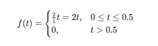

# **Exercícios**


```matlab
syms t;
x_t = -10*exp(-t) + cos(5*t);

x_transitoria = -10*exp(-t);

x_permanente = cos(5*t);

fplot(x_t, [0, 10], 'LineWidth', 2); hold on;
fplot(x_transitoria, [0, 10], '--r', 'LineWidth', 2);
fplot(x_permanente, [0, 10], '--g', 'LineWidth', 2);
grid on;

figure;
legend('Resposta Total', 'Resposta Transitória', 'Resposta Permanente');
```

```matlabTextOutput
Warning: Ignoring extra legend entries.
```

```matlab
xlabel('Tempo (t)');
ylabel('x(t)');
title('Resposta Transitória e Permanente');
```


```matlab
syms s;

m = 1; 
c = 2; 
k = 4;

% Função de Transferência G(s) = X(s)/F(s)
G_s = 1 / (m*s^2 + c*s + k);

pretty(G_s)
```

```matlabTextOutput
      1
------------
 2
s  + 2 s + 4
```

```matlab

[num, den] = numden(G_s); 
num = sym2poly(num);
den = sym2poly(den);
G_tf = tf(num, den);

% Resposta ao degrau unitário
figure;
step(G_tf);
grid on;
title('Resposta ao Degrau Unitário');
xlabel('Tempo (s)');
```


```matlab
t = 0:0.05:20;
y_t = 2*sin(t);

x_t = lsim(G_tf, y_t, t);

figure;
plot(t, y_t, '--r', 'LineWidth', 1.5); hold on;
plot(t, x_t, 'b', 'LineWidth', 2);
grid on;
legend('Entrada: Senoidal (y(t))', 'Saída: x(t)');
xlabel('Tempo (s)');
ylabel('Deslocamento x(t)');
title('Resposta do Sistema à Entrada Senoidal');
```




```matlab
syms t s;
f_t = 2*t * (heaviside(t) - heaviside(t - 0.5)); % Definição do sinal
F_s = laplace(f_t, t, s); % Transformada de Laplace

disp('Transformada de Laplace de f(t):');
```

```matlabTextOutput
Transformada de Laplace de f(t):
```

```matlab
disp(F_s);
```
 $\displaystyle \frac{2}{s^2 }-\frac{2\,{\mathrm{e}}^{-\frac{s}{2}} }{s^2 }-\frac{{\mathrm{e}}^{-\frac{s}{2}} }{s}$
 


```matlab
syms t s;
f = piecewise(0 <= t <= 1, 2*t, 1 < t <= 2, -2*t + 4, t > 2, 0);
F = laplace(f, t, s);
simplify(F)
```
ans = 
 $\displaystyle \textrm{laplace}\left(\left\lbrace \begin{array}{cl} 2\,t & \;\textrm{if}\;\;t\in \left\lbrack 0,1\right\rbrack \newline 4-2\,t & \;\textrm{if}\;\;t\in \left(1,2\right\rbrack \newline 0 & \;\textrm{if}\;\;2<t \end{array}\right.,t,s\right)$
 

 **6. Dada a Figura 21, encontrar a Transformada de Laplace da função e reproduzi\-la em MatLab.** 


```matlab
syms t s;
f_t = 4*t*(1 - t) * (heaviside(t) - heaviside(t - 1));
F_s = laplace(f_t, t, s);
pretty(F_s)
```

```matlabTextOutput
4 exp(-s)   8 exp(-s)    4    8
--------- + --------- + -- - --
     2           3       2    3
    s           s       s    s
```

```matlab

disp('Transformada de Laplace de f(t):');
```

```matlabTextOutput
Transformada de Laplace de f(t):
```

```matlab
disp(F_s);
```
 $\displaystyle \frac{4\,{\mathrm{e}}^{-s} }{s^2 }+\frac{8\,{\mathrm{e}}^{-s} }{s^3 }+\frac{4}{s^2 }-\frac{8}{s^3 }$
 

```matlab

fplot(f_t, [0, 1.5]);
grid on;
xlabel('tempo [s]');
ylabel('f(t)');
title('Função f(t)');
```

7. Na Figura 22 são apresentados alguns for¸camentos que podem ser obtidos a partir de combina¸c˜oes de outros for¸camentos. Com base na Figura 22, gerar o pulso trapezoidal conforme ilustrado na Figura 23 usando o prompt do MatLab, onde F0 = 10N, t1 = 1s, t2 = 2s, t3 = 2s.

```matlab
clc; clear; close all;
syms t

F0 = 10;
t1 = 1;
t2 = 2;
t3 = 3;

f_t = (F0/t1)*t * (heaviside(t) - heaviside(t - t1)) + ... % Subida
      F0 * (heaviside(t - t1) - heaviside(t - t2)) + ...   % Nível constante
      (F0/(t3 - t2)) * (t3 - t) * (heaviside(t - t2) - heaviside(t - t3)); % Descida

fplot(f_t, [0 4], 'LineWidth', 2);
grid on;
xlabel('Tempo [s]');
ylabel('Força [N]');
title('Pulso Trapezoidal');
ylim([-1 11]);
```


